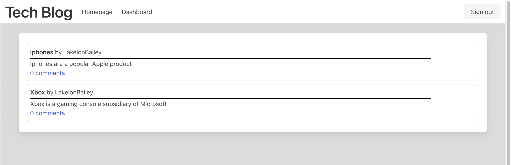

# Tech Blog

## Purpose
This app is a demonstration of a Model-View-Controller development layout in the form of a CMS-style Blog. This application allows users to create accounts, posts, and view other users' posts.

## Website Link
https://ltb-tech-blog.herokuapp.com/

## Screenshot

## Built With
- Node.js
- Express
- Sequelize
- MySQL
- SQL
- Handlebars

## Contributor(s)
- Lakelon Bailey

### Created July 2022